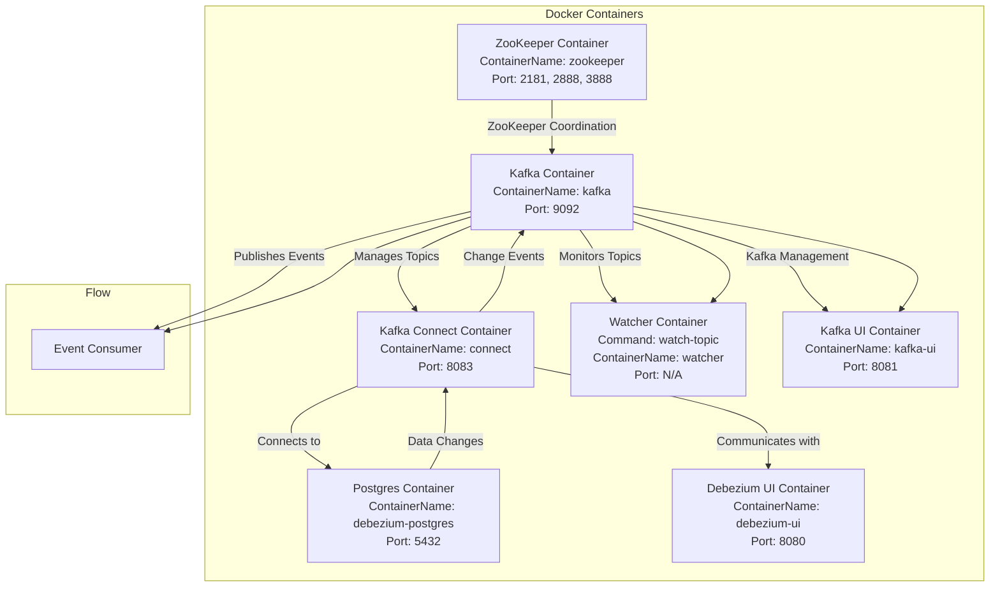

## GUI

[kafka-ui](http://localhost:8081/)

[debezium-ui](http://localhost:8080/)

### UML



## [チュートリアル](https://debezium.io/documentation/reference/stable/tutorial.html)

1. 構築

```bash
$ docker-compose up -d
```

```bash
$ docker ps | grep "debezium"
c3ce5aab204c   quay.io/debezium/kafka:latest                                    "/docker-entrypoint.…"   3 minutes ago   Up 3 minutes    9092/tcp                                                                                                          
                watcher
32880a6d0603   quay.io/debezium/debezium-ui:latest                              "/deployments/run-ja…"   3 minutes ago   Up 3 minutes    0.0.0.0:8080->8080/tcp, :::8080->8080/tcp                                                                         
                debezium-ui
7c70f3b11860   quay.io/debezium/kafka:latest                                    "/docker-entrypoint.…"   3 minutes ago   Up 3 minutes    0.0.0.0:9092->9092/tcp, :::9092->9092/tcp                                                                         
                kafka
8cc26b84046a   quay.io/debezium/connect:latest                                  "/docker-entrypoint.…"   3 minutes ago   Up 3 minutes    8778/tcp, 0.0.0.0:8083->8083/tcp, :::8083->8083/tcp, 9092/tcp                                                     
                connect
77cc7f4dffec   quay.io/debezium/example-postgres                                "docker-entrypoint.s…"   3 minutes ago   Up 3 minutes    0.0.0.0:5432->5432/tcp, :::5432->5432/tcp                                                                         
                debezium-postgres
ac3178c5056c   quay.io/debezium/zookeeper:latest                                "/docker-entrypoint.…"   3 minutes ago   Up 3 minutes    0.0.0.0:2181->2181/tcp, :::2181->2181/tcp, 0.0.0.0:2888->2888/tcp, :::2888->2888/tcp, 0.0.0.0:3888->3888/tcp, :::3888->3888/tcp   zookeeper
``` 

2. コネクタ登録

[POST /inventory-connector](/connectors/POST_inventory-connector.http)

```json
{
  "name": "inventory-connector",
  "config": {
    "connector.class": "io.debezium.connector.postgresql.PostgresConnector",
    "database.hostname": "debezium-postgres",
    "database.port": "5432",
    "database.user": "postgres",
    "database.password": "debezium",
    "database.dbname": "postgres",
    "topic.prefix": "dbserver1",
    "table.include.list": "inventory.customers",
    "plugin.name": "decoderbufs",
    "name": "inventory-connector"
  },
  "tasks": [],
  "type": "source"
}
```

3. `inventory.customers` 更新

なんか更新

4.  監視

[debezium-ui](http://localhost:8080/)

```log
WARNING: Using default NODE_ID=1, which is valid only for non-clustered installations.
Starting in ZooKeeper mode using NODE_ID=1.
Using ZOOKEEPER_CONNECT=zookeeper:2181
Using configuration config/server.properties.
Using KAFKA_LISTENERS=PLAINTEXT://172.27.0.7:9092 and KAFKA_ADVERTISED_LISTENERS=PLAINTEXT://172.27.0.7:9092
Using KAFKA_BROKER=kafka:9092
Contents of topic dbserver1.inventory.customers:
```

## イベント構成

### キー詳細

```json
{
    "schema": {
        "type": "struct",
        "fields": [
            {
                "type": "int32",
                "optional": false,
                "default": 0,
                "field": "id"
            }
        ],
        "optional": false,
        "name": "dbserver1.inventory.customers.Key"
    },
    "payload": {
        "id": 1006
    }
}
```

### イベント値詳細

```json
{
    "schema": {
        "type": "struct",
        "fields": [
```

#### before
イベント発生前の行の状態

```json
            {
                "type": "struct",
                "fields": [
                    {
                        "type": "int32",
                        "optional": false,
                        "default": 0,
                        "field": "id"
                    },
                    {
                        "type": "string",
                        "optional": false,
                        "field": "first_name"
                    },
                    {
                        "type": "string",
                        "optional": false,
                        "field": "last_name"
                    },
                    {
                        "type": "string",
                        "optional": false,
                        "field": "email"
                    }
                ],
                "optional": true,
                "name": "dbserver1.inventory.customers.Value",
                "field": "before"
            },
```

#### after

イベント発生後の行の状態

```json
            {
                "type": "struct",
                "fields": [
                    {
                        "type": "int32",
                        "optional": false,
                        "default": 0,
                        "field": "id"
                    },
                    {
                        "type": "string",
                        "optional": false,
                        "field": "first_name"
                    },
                    {
                        "type": "string",
                        "optional": false,
                        "field": "last_name"
                    },
                    {
                        "type": "string",
                        "optional": false,
                        "field": "email"
                    }
                ],
                "optional": true,
                "name": "dbserver1.inventory.customers.Value",
                "field": "after"
            },
```

#### source

メタデータ

```json
            {
                "type": "struct",
                "fields": [
                    {
                        "type": "string",
                        "optional": false,
                        "field": "version"
                    },
                    {
                        "type": "string",
                        "optional": false,
                        "field": "connector"
                    },
                    {
                        "type": "string",
                        "optional": false,
                        "field": "name"
                    },
                    {
                        "type": "int64",
                        "optional": false,
                        "field": "ts_ms"
                    },
                    {
                        "type": "string",
                        "optional": true,
                        "name": "io.debezium.data.Enum",
                        "version": 1,
                        "parameters": {
                            "allowed": "true,last,false,incremental"
                        },
                        "default": "false",
                        "field": "snapshot"
                    },
                    {
                        "type": "string",
                        "optional": false,
                        "field": "db"
                    },
                    {
                        "type": "string",
                        "optional": true,
                        "field": "sequence"
                    },
                    {
                        "type": "int64",
                        "optional": true,
                        "field": "ts_us"
                    },
                    {
                        "type": "int64",
                        "optional": true,
                        "field": "ts_ns"
                    },
                    {
                        "type": "string",
                        "optional": false,
                        "field": "schema"
                    },
                    {
                        "type": "string",
                        "optional": false,
                        "field": "table"
                    },
                    {
                        "type": "int64",
                        "optional": true,
                        "field": "txId"
                    },
                    {
                        "type": "int64",
                        "optional": true,
                        "field": "lsn"
                    },
                    {
                        "type": "int64",
                        "optional": true,
                        "field": "xmin"
                    }
                ],
                "optional": false,
                "name": "io.debezium.connector.postgresql.Source",
                "field": "source"
            },
```

#### transaction

```json
            {
                "type": "struct",
                "fields": [
                    {
                        "type": "string",
                        "optional": false,
                        "field": "id"
                    },
                    {
                        "type": "int64",
                        "optional": false,
                        "field": "total_order"
                    },
                    {
                        "type": "int64",
                        "optional": false,
                        "field": "data_collection_order"
                    }
                ],
                "optional": true,
                "name": "event.block",
                "version": 1,
                "field": "transaction"
            },
```

なんこれ

```json
            {
                "type": "string",
                "optional": false,
                "field": "op"
            },
            {
                "type": "int64",
                "optional": true,
                "field": "ts_ms"
            },
            {
                "type": "int64",
                "optional": true,
                "field": "ts_us"
            },
            {
                "type": "int64",
                "optional": true,
                "field": "ts_ns"
            }
        ],
        "optional": false,
        "name": "dbserver1.inventory.customers.Envelope",
        "version": 2
    },
```

#### payload

```json
    "payload": {
        "before": null,
        "after": {
            "id": 1006,
            "first_name": "a",
            "last_name": "a",
            "email": "a@a.a"
        },
        "source": {
            "version": "3.0.0.CR2",
            "connector": "postgresql",
            "name": "dbserver1",
            "ts_ms": 1727751428720,
            "snapshot": "last",
            "db": "postgres",
            "sequence": "[null,\"34548792\"]",
            "ts_us": 1727751428720089,
            "ts_ns": 1727751428720089000,
            "schema": "inventory",
            "table": "customers",
            "txId": 783,
            "lsn": 34548792,
            "xmin": null
        },
        "transaction": null,
        "op": "r",
        "ts_ms": 1727751428811,
        "ts_us": 1727751428811164,
        "ts_ns": 1727751428811164489
    }
}
```

5. kafka-ui

```bash
$ docker run -it --rm --name kafka-ui --network debezium_network -p 8081:8080 -e DYNAMIC_CONFIG_ENABLED=true provectuslabs/kafka-ui
```

 - Bootstrap Servers  
   - kafka:9092
 - Kafka Connect
   - http://connect:8083

# todo

 - ブローカー
 - スナップショット周り
 - 運用するうえでのリカバリ等
 - 論理デコード、レプリケーション周り
   - https://www.postgresql.org/docs/14/logicaldecoding-explanation.html
   - https://www.postgresql.org/docs/current/protocol-logicalrep-message-formats.html
   - サンプルはdecoderbufs、postgresql10からはもとからプラグイン入ってるっぽいpgoutput
 - 